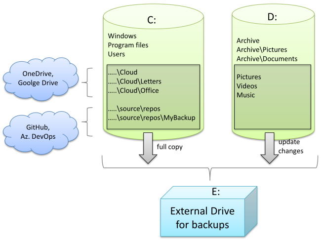
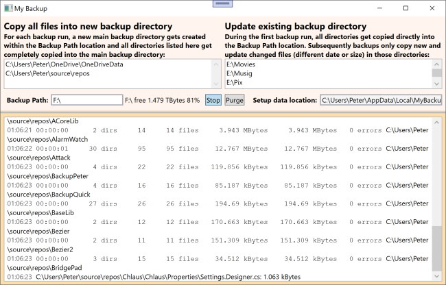

# MyBackup

There are many reasons to write your own backup program.
It's convenient  to have all your important files copied automatically 
to the cloud (google drive, GitHub, etc.), but that is not enough 
because you might lose access to that account or a virus has 
overwritten the data on your disk 
and also spoiled your copies in the cloud. As a software developer, you might 
have big source directories, which you like to backup often, but 
without the *obj* and *bin* directories, you may even want to skip 
*.git* and *.vs* directories. 

You might also have other special backup needs, like:
* Files which don't change anymore and you just copy them manually once to 
the backup drive (**Archive**)
* Files you want to get copied with every backup run, like documents or source code. This allows to go backwards in time in case you deleted something by mistake. (**Copy**)
* Files you want only to get copied when they got newly added or their content changed (date, size) (**Update**)

You might have other special backup needs. My recommendation is that you 
use *MyBackup* as a starting point and then add a few lines of code to cater 
for youR particular needs. You can find more detailed info about *MyBackup* on 
CodeProject.com:

https://www.codeproject.com/Articles/5342118/Why-SW-developers-should-write-their-own-backup-ap

I hope MyBackup is quite straightforward to use. Again, for more details 
see the link above.
